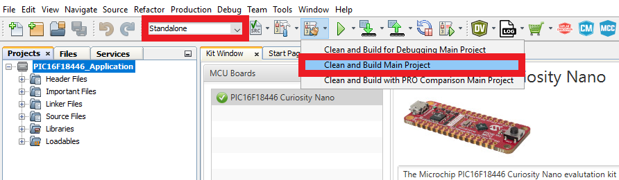
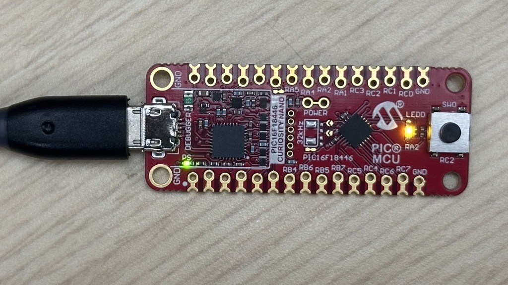
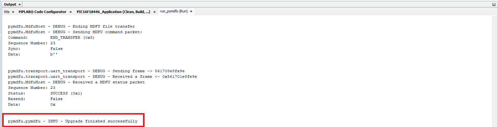

<!--  -->

<a target="_blank" href="https://www.microchip.com/" id="top-of-page">
   <picture>
      <source media="(prefers-color-scheme: light)" srcset="images/mchp_logo_light.png" width="350">
      <source media="(prefers-color-scheme: dark)" srcset="images/mchp_logo_dark.png" width="350">
      
   </picture>
</a>

# 8-Bit Microchip Device Firmware Update (MDFU) with Multiple Images and Anti-Rollback Support Solution for the PIC16F18446 Curiosity Nano Evaluation Kit

This repository contains two MPLAB® X projects designed to showcase the utilization of the 8-Bit MDFU Client library in creating an efficient development ecosystem within MPLAB® X, which also facilitates firmware updates for an application with multiple images and anti-rollback support.

## Demonstration

### Introduction

1. Bootloader Client Project
    - UART Communication: UART is being used to transfer the new application program data from the host to the client through the debugger's CDC ports
        - Baud Rate: 115200
        - TX: RB4
        - RX: RB6
    - CRC32 Verification: The client firmware will compute a CRC32 over the application code and compare that value against a known CRC stored at an absolute address at the end of the application image
    - Entry Pin Enabled: The bootloader sequence can be initiated through a hardware I/O pin if held down at reset
    - Indicator Pin Enabled: The client firmware will indicate if the bootloader is running by holding the LED on
    - Application Start Address is 0x2000 (word address): The client firmware is configured to install the application code at address 0x2000 and the bootloader partition will include all the Program Flash Memory (PFM) from address 0x0000 to 0x1FFF
    - Multi-Image support Enabled: Bootloader can suport storage of multiple application images
    - Number of images additional to the execution space is one
    -  Application image size is 0x1000: This is automatically calculated based on the total flash memory left in the application space divided by the total number of images
    - Staging Image ID is set to 1
    - Anti-rollback support is enabled. Application be updated with only new versions.

2. Application Project:
    - Supports push button Device Firmware Update (DFU) initialization: The application firmware supports pushing the on-board switch to initiate a DFU by using the forced entry mechanism of the bootloader client
    - Supports message-based DFU initialization: The application firmware supports receiving an 'r' character over the CDC ports to erase the footer data of the application and cause a DFU to be initialized
        - Baud Rate: 9600
        - TX: RB5
        - RX: RB4
    - Blinks the LED using a timer interrupt: The application firmware is configured to blink the on-board LED at a rate of 200 ms using a timer interrupt
    - Multiple project configurations: 
        - **Stand-alone configuration:** This project configuration builds the firmware images that can be loaded through the client firmware
        - **Combined configuration:** This project configuration combines the bootloader firmware and the application firmware into one single hex file. This is a very helpful practice that allows the debugger to be run on both projects simultaneously.

    - Application space memory partitions according to bootloader configuration:

        | Partition Name                  | Address Range           |
        |---------------------------------|------------------------ |
        | Bootloader                      | 0x0000-0x1FFF           |
        | Execution Image                 | 0x2000-0x2FFF           |
        | Spare Image 1 (Staging Image)   | 0x3000-0x3FFF           |

### Execution

1. Open MPLAB&reg; X IDE.

2. Select *File>Open Project>PIC18F56Q24_Application.X*.

3. Right click PIC18F56Q24_Application in the **Projects** tab and select Set as Main Project.

4. Build the application configurations.
    
    a. Select Standalone from the Set Project Configuration drop-down menu and then select **Clean and Build Main Project**.

    

    b. Next, select Combined from the Set Project Configuration drop-down menu.
    
    

5. Open the Data Visualizer and connect to the device through the COM port connected to the on-board debugger.

6. Select **Make and Program Device Main Project** and then check the Data Visualizer console to watch the application begin running.

By default, version 1 of the application will be programmed in the microcontroller.

 
    
 At this point, the on-board LED blinks with a period of 200 ms.

7. Push and hold the on-board push button or enter an 'r' character to the application code using the Data Visualizer to initiate a device firmware update.

 

At this point in the demonstration, the MDFU Client firmware has taken control of the microcontroller (MCU) core and is waiting for protocol commands to be sent to it over UART. During this time, the new application firmware image can be sent.

For a bootloader that supports multiple images, this application image will first be downloaded in the staging area and verified to have a higher version than the current application running in the execution space.
This image will be copied to the execution space only if the version is **higher** than the current running application.

8. Disconnect from the device's serial port by clicking the red stop button available on the Data Visualizer.

9. Open the example update script file by navigating to *Projects>Important Files>run_pymdfu.bat* or *Projects>Important Files>run_pymdfu.sh* and update the name of the target serial port to the same name shown in the Data Visualizer.

10. Right click the script file and select Run.

 
11. The update is successful as the version of the application in the image used for update in step 10 is two, which is greater than the current application running on board (current version is one). 

It can be observed that the application with version 2 is blinking the LED at a slower rate than before. This demonstrates the bootloader's capability to store multiple images in multiple image partitions.

12. To test the anti-rollback feature, repeat step 7 to transfer control to the bootloader.

13. In the run_pymdfu script, comment line 9 and uncomment line 12. 

14. Right click the script file and select Run.

> **IMPORTANT:** To run these update scripts from within MPLAB&reg;, include your Python instance in your PATH variable. If the tools are not executable from within MPLAB&reg; X for any reason, you can run the same scripts from another terminal or reinstall your Python instance with the correct PATH configuration.

## Back-Up Image and Restoration Feature
>**Note:** Due to the limited memory resources of most PIC16F devices, the back-up image feature may only be usable depending on the memory footprint of your application.

To enable the back-up image, the total number for additional images on the bootloader client UI in MCC needs to be greater than one. The ID for the back-up image can be configured from the available IDs.

Configuration example:

Upon enabling this feature, in case of corruption of the execution space, the back-up image will be copied into the execution space.

## Example Scripts

This repository has provided a collection of scripts that demonstrate how to call the various Python tools used to create an efficient ecosystem.

|Script Name |Description |
|--- |--- |
| `build_image.bat`/`build_image.sh` |This script can be called by the post build step of the Standalone application configuration to build the application binary image. This script can also be run on its own and it will assume that the application hex is found in the `dist/Standalone/production` path. |
| `run_pymdfu.bat`/`run_pymdfu.sh` |This script can be run from within MPLAB&reg; X by right clicking the script file (e.g., *Projects Tab>Important Files>run_pymdfu.bat*) and selecting Run. This could also be run as a stand-alone script but it would be just as easy to copy the command out and use it in your own terminal directly instead of running this script from your terminal.|

For convenience, this demonstration contains two pre-built application images to showcase the multi-image and anti-rollback features. As such, running the `build_image.bat`/`build_image.sh` is not required. However, if you would like to create additional application images, this can be done by incorporating the `build_image.bat`/`build_image.sh` script into a post build command.

>**Hint:**  The Standalone Configuration of the application project contains the post build command in the Project Properties for generating an application image. To execute this post build command, navigate to  *Project Properties>Conf: Standalone>Building* and check the "Execute this line after build" box. Then, click **Apply** and **OK**.

## References

For additional information, refer to the following resources:

- [Getting Started Document, API Reference and Update Image Specification](https://onlinedocs.microchip.com/v2/keyword-lookup?keyword=8BIT_MDFU_CLIENT&version=latest&redirect=true)
- [8-Bit MDFU Client Release Notes](https://onlinedocs.microchip.com/v2/keyword-lookup?keyword=RELEASE_NOTES_8BIT_MDFU_CLIENT_LIBRARY&version=latest&redirect=true)
- [8-Bit MDFU Client Known Issues List](https://onlinedocs.microchip.com/v2/keyword-lookup?keyword=KNOWN_ISSUES_8BIT_MDFU_CLIENT&version=latest&redirect=true)
[MDFU Protocol Specification](https://ww1.microchip.com/downloads/aemDocuments/documents/DEV/ProductDocuments/SupportingCollateral/Microchip-Device-Firmware-Update-MDFU-Protocol-DS50003743.pdf)
- [PIC16F18446 Family Product Page](https://www.microchip.com/en-us/product/PIC16F18446)

[Back to Top](#8-bit-microchip-device-firmware-update-mdfu-solution-for-the-pic16f18446-curiosity-nano-evaluation-kit)