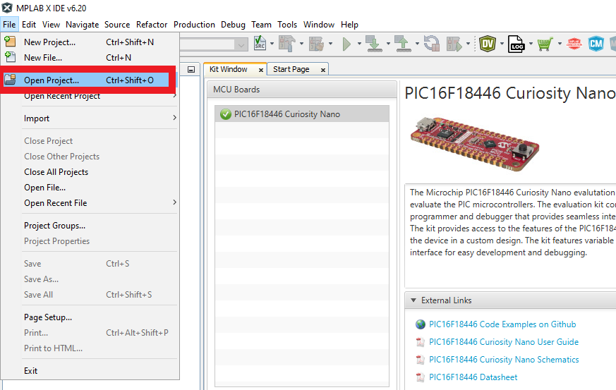
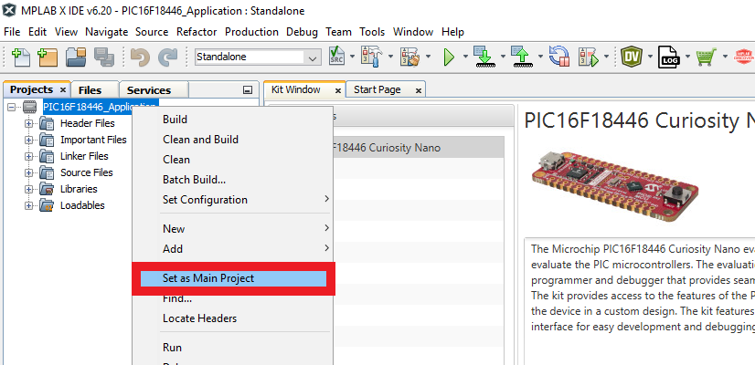
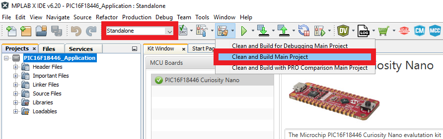
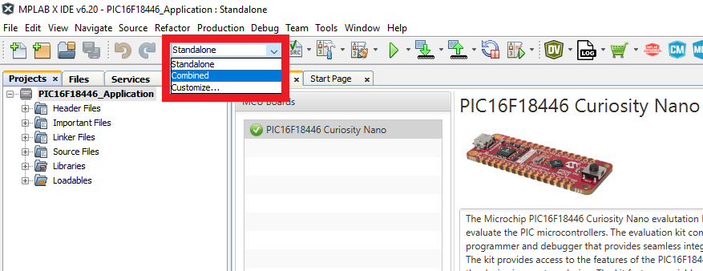
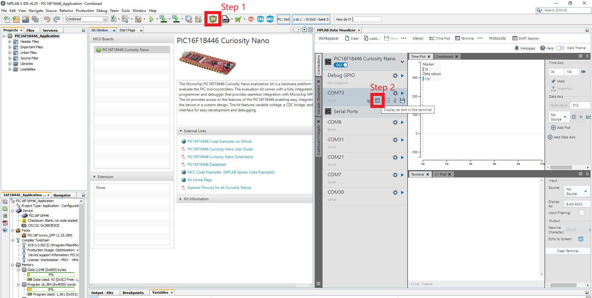
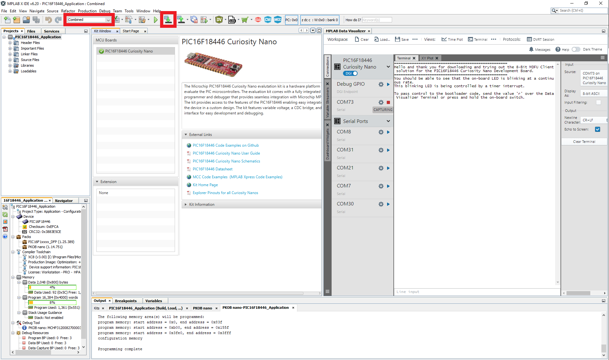
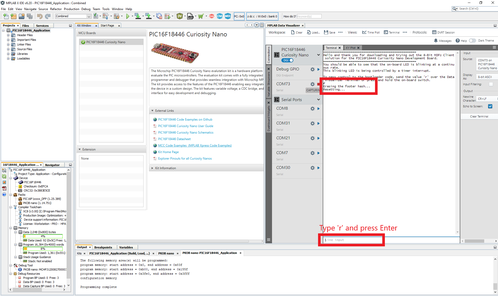
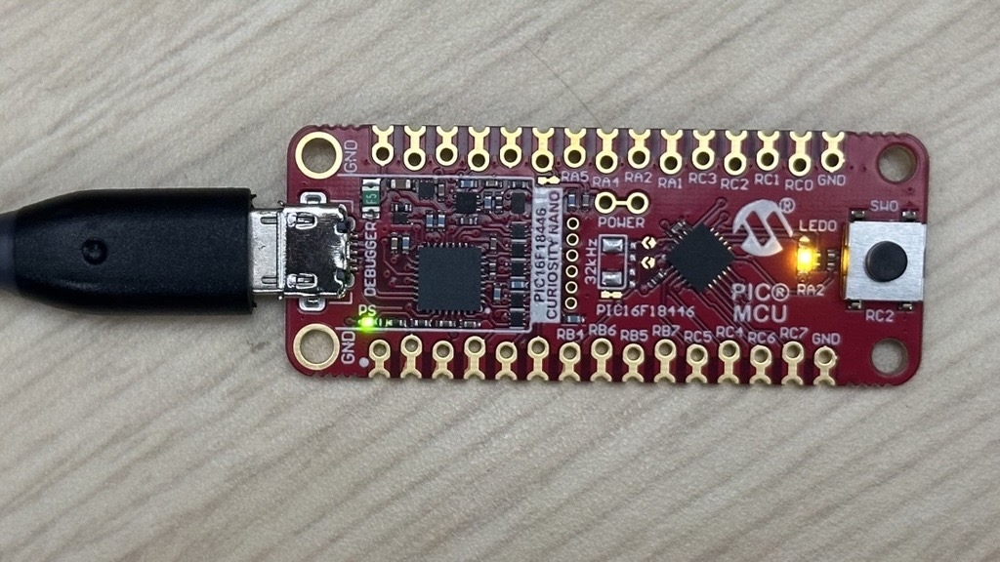
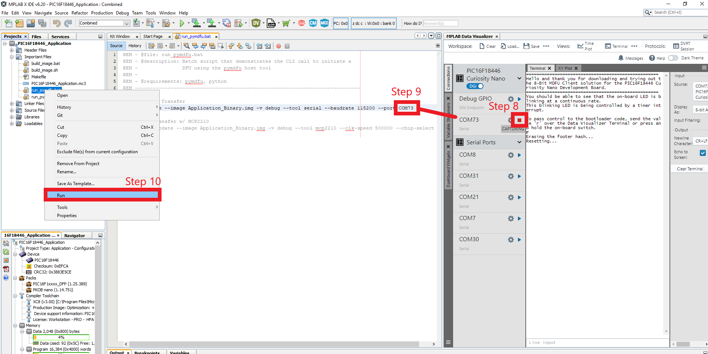
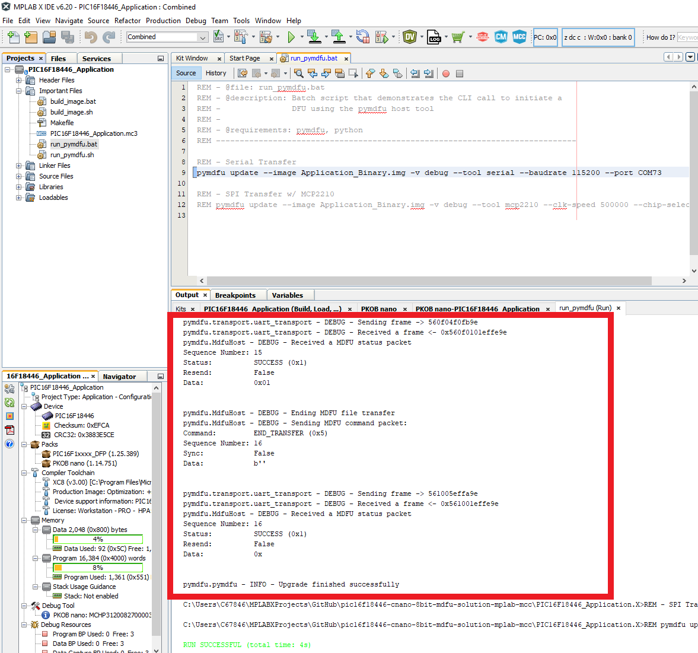

<!--  -->

<a target="_blank" href="https://www.microchip.com/" id="top-of-page">
   <picture>
      <source media="(prefers-color-scheme: light)" srcset="images/mchp_logo_light.png" width="350">
      <source media="(prefers-color-scheme: dark)" srcset="images/mchp_logo_dark.png" width="350">
      
   </picture>
</a>

# 8-Bit Microchip Device Firmware Update (MDFU) Solution for the PIC16F18446 Curiosity Nano Evaluation Kit

## Introduction

This repository provides two MPLAB&reg; X projects that work together to demonstrate how the 8-Bit MDFU Client library
can be used to create an efficient development ecosystem in MPLAB&reg; X that also supports firmware updates.

## Hardware Requirements

- [PIC16F18446 Curiosity Nano Evaluation Kit](https://www.microchip.com/en-us/development-tool/DM164144)
- USB-A to USB Micro B cable

## Software Requirements

- [MPLAB&reg; X IDE 6.20](https://www.microchip.com/en-us/tools-resources/develop/mplab-x-ide)
- [XC8 Compiler](https://www.microchip.com/en-us/tools-resources/develop/mplab-xc-compilers)
- [Avr-GCC Compiler](https://www.microchip.com/en-us/tools-resources/develop/microchip-studio/gcc-compilers)
- MCC Core v5.7.1 or later
- MCC Melody Core v2.8.0 or later
- [MCC Melody 8-Bit MDFU Client](https://www.npmjs.com/package/@mchp-mcc/mdfu-client-8bit)
- [Python v3.8 or later](https://www.python.org/)
- [pyfwimagebuilder v1.0.1 or later](https://pypi.org/project/pyfwimagebuilder/)
- [pymdfu v2.5.1](https://pypi.org/project/pymdfu/)
 
## Hardware Setup
1. Connect the PIC16F18446 Curiosity Nano Evaluation Kit to the PC using the USB-A to UBS Micro B.

## Demonstration

### Introduction

1. Bootloader Client Project
    - UART Communication: UART is being used to transfer the new application program data from the Host to the Client through the debugger's CDC ports.
        - Baudrate 115200
        - TX: RB4
        - RX: RB6
    - CRC32 Verification: The client firmware will compute a CRC32 over the application code and compare that value against a known CRC stored at an absolute address at the end of the application image.
    - Entry Pin Enabled: The bootloader sequence can be initiated through a hardware IO pin if held down at reset.
    - Indicator Pin Enabled: The client firmware will indicate if the bootloader is running by holding the LED on.
    - Application Start Address is 0x1000 (**word address**): The client firmware is configured to install the application code at address 0x1000 and the bootloader partition will include all of PFM from word address 0x0000 to 0xFFF.

2. Application Project:
    - Supports push button DFU initialization: The application firmware supports pushing the on-board switch to initiate a DFU by using the forced entry mechanism of the bootloader client.
    - Supports message based DFU initialization: The application firmware supports receiving an 'r' character over the CDC ports to erase the footer data of the application and cause a DFU to be initialized.
        - Baudrate 9600
        - TX: RB4
        - RX: RB6
    - Blinks the LED using a timer interrupt: The application firmware is configured to blink the on-board LED at a rate of 200 ms using a timer interrupt.
    - Multiple project configurations: 
        - **Standalone Configuration**: This project configuration is used to build the firmware images that can be loaded through the client firmware.
        - **Combined Configuration**: This project configuration is used to combined the bootloader firmware and the application firmware into one single hex file. This is a very helpful practice that allows the debugger to be run on both projects at one time.

### Execution

1. Open MPLAB&reg; X IDE.

2. Select *File>Open Project>PIC16F18446_Application.X*.

3. Right click PIC16F18446_Application in the **Projects** tab and select **Set as Main Project**.

4. Build the application configurations.
    
    a. Select Standalone from the **Set Project Configuration** drop-down menu and then select **Clean and Build Main Project**.

    
    
    b. Next, select Combined from the **Set Project Configuration** drop-down menu.

    

5. Open the Data Visualizer and connect to the device through the COM port connected to the on-board debugger.

6. Select **Make and Program Device Main Project** and then watch the Data Visualizer console to watch the application begin running.

 

7. Send an 'r' character to the application code using the Data Visualizer to initiate a device firmware updated.

 

At this point in the demonstration, the MDFU Client firmware has taken control of the MCU core and is waiting for protocol commands to be sent to it over UART. At this point in time we can begin to send the new application firmware image.

8. Disconnect from the device's serial port by clicking on the red stop button available on the Data Visualizer.

9. Open the example update script file by navigating to *Projects>Important Files>run_pymdfu.bat* or *Projects>Important Files>run_pymdfu.sh* and update the name of the target serial port to the same name shown in the Data Visualizer.

10. Right click on the script file and select **Run**

 

> **IMPORTANT:** To run these update scripts from within MPLAB&reg; X you must include your Python instance in your PATH variable. If the tools are not executable from within MPLAB&reg; X for any reason you can run the same scripts from another terminal or reinstall your Python instance with the correct PATH configuration.

## Example Scripts

This repository has provided a collection of scripts that demonstrate how to call the various python tools used to create this efficient ecosystem.

|Script Name |Description |
|--- |--- |
| `build_image.bat`/`build_image.sh` |This script can be called by the post build step of the Standalone application configuration to build the application binary image. This script can also be run on its own and it will assume that the application hex is found in the `dist/Standalone/production` path. |
| `run_pymdfu.bat`/`run_pymdfu.sh` |This script can be run from within MPLAB&reg; X by right clicking on the script file (e.g., *Projects Tab>Important Files>run_pymdfu.bat*) and selecting **Run**. This could also be run as a standalone script but it would be just as easy to copy the command out and use it in your own terminal directly instead of running this script from your terminal.|

## References

For additional information, refer to the following resources:

- [Getting Started, MCU8 Firmware Image Specification, API Reference, Memory Consumption Report](https://onlinedocs.microchip.com/v2/keyword-lookup?keyword=8BIT_MDFU_CLIENT&version=latest&redirect=true)
- [8-Bit MDFU Client Release Note](https://onlinedocs.microchip.com/v2/keyword-lookup?keyword=MCC.MELODY.MDFU-CLIENT-8BIT.RELEASENOTES&version=latest&redirect=true)
- [8-Bit MDFU Client Known Issues](https://onlinedocs.microchip.com/v2/keyword-lookup?keyword=KNOWN_ISSUES_8BIT_MDFU_CLIENT&version=latest&redirect=true)
- [MDFU Protocol Specification](https://ww1.microchip.com/downloads/aemDocuments/documents/DEV/ProductDocuments/SupportingCollateral/Microchip-Device-Firmware-Update-MDFU-Protocol-DS50003743.pdf)
- [PIC16F18446 Product Page](https://www.microchip.com/en-us/product/pic16f18446)

[Back to Top](#8-bit-microchip-device-firmware-update-mdfu-solution-for-the-pic16f18446-curiosity-nano-evaluation-kit)

