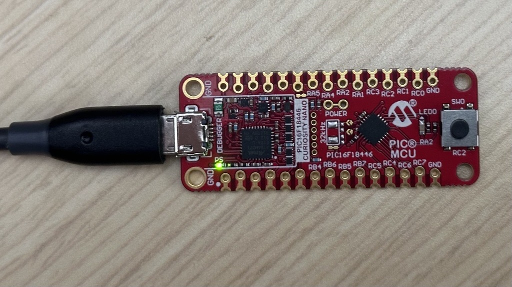

<!--  -->

<a target="_blank" href="https://www.microchip.com/" id="top-of-page">
   <picture>
      <source media="(prefers-color-scheme: light)" srcset="images/mchp_logo_light.png" width="350">
      <source media="(prefers-color-scheme: dark)" srcset="images/mchp_logo_dark.png" width="350">
      
   </picture>
</a>

# 8-Bit Microchip Device Firmware Update (MDFU) Solution for the PIC16F18446 Curiosity Nano Evaluation Kit

## Introduction

This repository contains two configurations to showcase the utilization of the 8-Bit MDFU Client library in creating an efficient development ecosystem within MPLAB® X. 

Each of these configurations contains two MPLAB® X projects: the bootloader client project and the application project.
 1. [Basic Bootloader Client Example Using UART](./README-BASIC.md)
 2. [Bootloader Client Example Using UART With Multiple Image and Anti-Rollback Support](./README-MI-ARB.md)

## Software Used

- [MPLAB&reg; X IDE 6.25 or newer](https://www.microchip.com/en-us/tools-resources/develop/mplab-x-ide)
- [XC8 Compiler](https://www.microchip.com/en-us/tools-resources/develop/mplab-xc-compilers)
- [Avr-GCC Compiler](https://www.microchip.com/en-us/tools-resources/develop/microchip-studio/gcc-compilers)
- MCC Core v5.8.2 or later
- MCC Melody Core v2.9.1 or later
- [MCC Melody 8-Bit MDFU Client](https://www.npmjs.com/package/@mchp-mcc/mdfu-client-8bit)
- [Python v3.8 or later](https://www.python.org/)
- [pyfwimagebuilder v1.0.1.14 or later](https://pypi.org/project/pyfwimagebuilder/)
- [pymdfu v2.5.1.9](https://pypi.org/project/pymdfu/)
 
## Hardware Used

- [PIC16F18446 Curiosity Nano Evaluation Kit](https://www.microchip.com/en-us/development-tool/DM164144)
- USB-A to USB Micro B cable

## Hardware Setup
Connect the PIC16F18446 Curiosity Nano Evaluation Kit to the PC using the USB-A to UBS Micro B.

## References

For additional information, refer to the following resources:

- [Getting Started, MCU8 Firmware Image Specification, API Reference, Memory Consumption Report](https://onlinedocs.microchip.com/v2/keyword-lookup?keyword=8BIT_MDFU_CLIENT&version=latest&redirect=true)
- [8-Bit MDFU Client Release Note](https://onlinedocs.microchip.com/v2/keyword-lookup?keyword=MCC.MELODY.MDFU-CLIENT-8BIT.RELEASENOTES&version=latest&redirect=true)
- [8-Bit MDFU Client Known Issues](https://onlinedocs.microchip.com/v2/keyword-lookup?keyword=KNOWN_ISSUES_8BIT_MDFU_CLIENT&version=latest&redirect=true)
- [MDFU Protocol Specification](https://ww1.microchip.com/downloads/aemDocuments/documents/DEV/ProductDocuments/SupportingCollateral/Microchip-Device-Firmware-Update-MDFU-Protocol-DS50003743.pdf)
- [PIC16F18446 Product Page](https://www.microchip.com/en-us/product/pic16f18446)

[Back to Top](#8-bit-microchip-device-firmware-update-mdfu-solution-for-the-pic16f18446-curiosity-nano-evaluation-kit)

